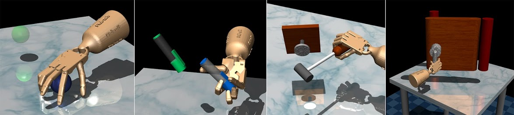

# DAPG for Dexterous Hand Manipulation

This accompanies the [DAPG project](https://sites.google.com/view/deeprl-dexterous-manipulation), presented at RSS 2018. Please see the project page for the paper and video demonstration of results.

<td></td>

## Organization

The overall project is organized into three repositories:

1. [mjrl](https://github.com/aravindr93/mjrl) provides a suite of learning algorithms for various continuous control tasks simulated in MuJoCo. This includes the NPG implementation and the DAPG algorithm used in the paper.
2. [mj_envs](https://github.com/vikashplus/mj_envs) provides a suite of continuous control tasks simulated in MuJoCo, including the dexterous hand manipulation tasks used in the paper.
3. [hand_dapg](https://github.com/aravindr93/hand_dapg) (this repository) serves as the landing page and contains the human demonstrations and pre-trained policies for the tasks.

This modular organization was chosen to allow for rapid and independent developments along different directions such as algorithms and interesting tasks, and also to facilitate sharing of results with the broader research community.

## Getting started

Each repository above contains detailed setup instructions. 
1. **Step 1:** Install [mjrl](https://github.com/aravindr93/mjrl), using instructions in the repository ([direct link](https://github.com/aravindr93/mjrl/tree/master/setup)). `mjrl` comes with an anaconda environment which helps to easily import and use a variety of MuJoCo tasks.
2. **Step 2:** Install [mj_envs](https://github.com/vikashplus/mj_envs) by following the instructions in the repository. Note that `mj_envs` uses git submodules, and hence must be cloned correctly per instructions in the repo.
3. **Step 3:** After setting up `mjrl` and `mj_envs`, clone this repository and use the following commands to visualize the demonstrations and pre-trained policies.

```
$ cd dapg
$ python utils/visualize_demos.py --env_name relocate-v0
$ python utils/visualize_policy.py --env_name relocate-v0 --policy policies/relocate-v0.pickle
```

**NOTE:** If the visualization results in a GLFW error, this is because `mujoco-py` does not see some graphics drivers correctly. This can usually be fixed by explicitly loading the correct drivers before running the python script. See [this page](https://github.com/aravindr93/mjrl/tree/master/setup#known-issues) for details.

## Bibliography

If you use the code in this or associated repositories above, please cite the following paper.
```
@INPROCEEDINGS{Rajeswaran-RSS-18,
    AUTHOR    = {Aravind Rajeswaran AND Vikash Kumar AND Abhishek Gupta AND
                 Giulia Vezzani AND John Schulman AND Emanuel Todorov AND Sergey Levine},
    TITLE     = "{Learning Complex Dexterous Manipulation with Deep Reinforcement Learning and Demonstrations}",
    BOOKTITLE = {Proceedings of Robotics: Science and Systems (RSS)},
    YEAR      = {2018},
}
```
